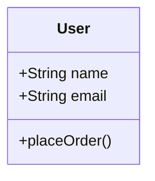
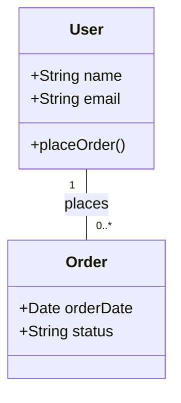
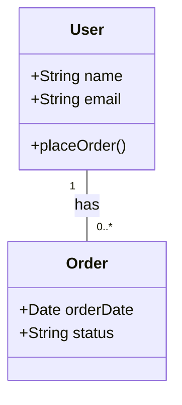
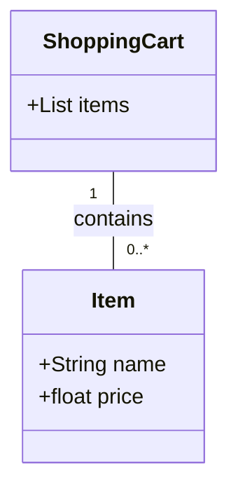
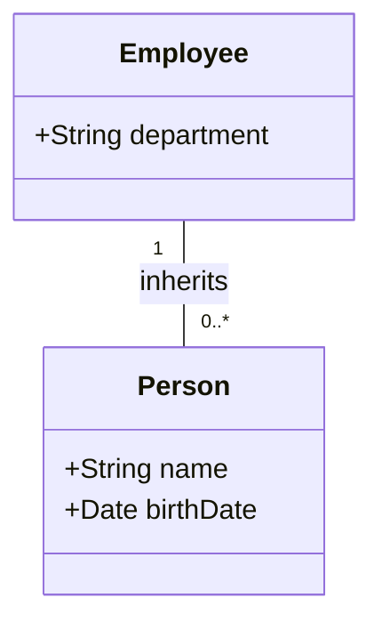
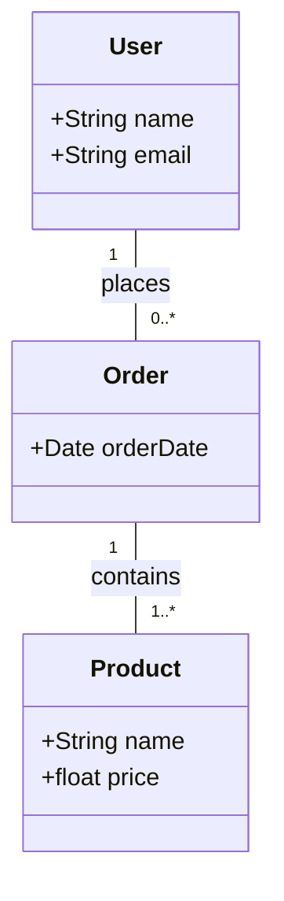
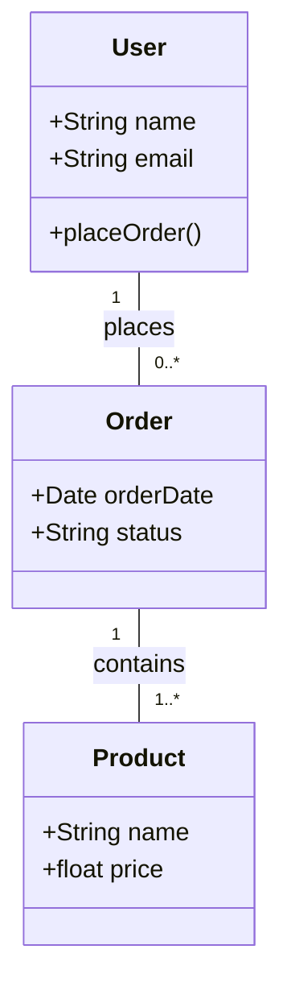

### Test Case 1: Basic Single Class with No Relationships

### Test Case 2: Association Relationship

### Test Case 2: Aggregation Relationship

### Test Case 3: Composition Relationship

### Test Case 4: Inheritance

### Test Case 5: Complex Diagram with Multiple Relationships

### Test Case 6: Complex Diagram with Multiple Relationships

