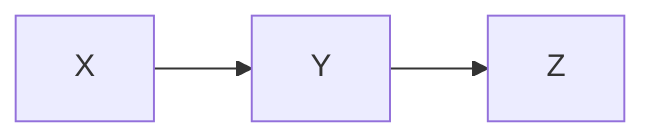
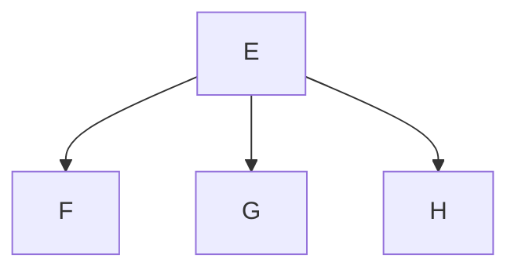
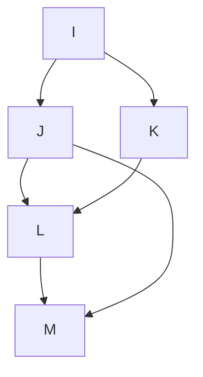
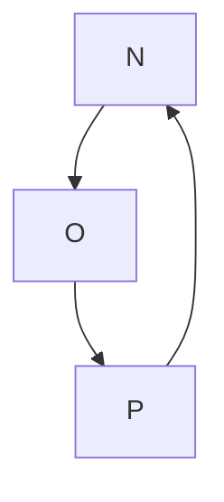
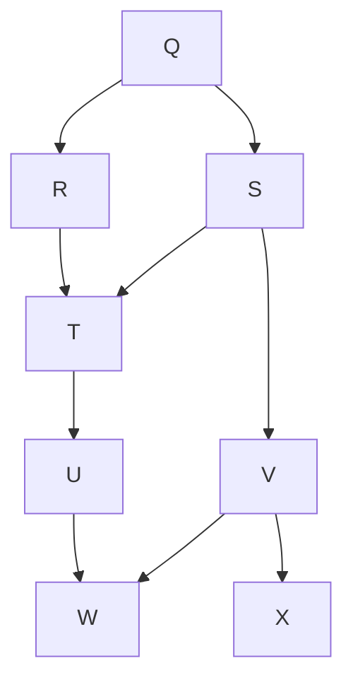
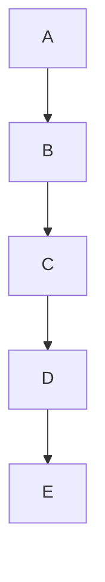
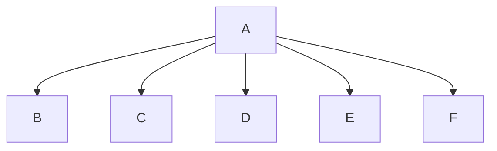

### Test Case 1: Simple Linear Graph

### Test Case 2: Branching Graph

### Test Case 3: Complex Graph with Multiple Connections

### Test Case 4: Cyclic Graph

### Test Case 5: Larger Acyclic Graph

### Test Case 6: Deep Tree Structure

### Test Case 7: Wide Tree Structure

