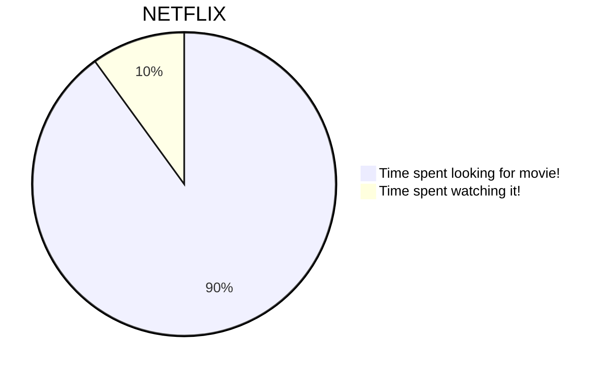
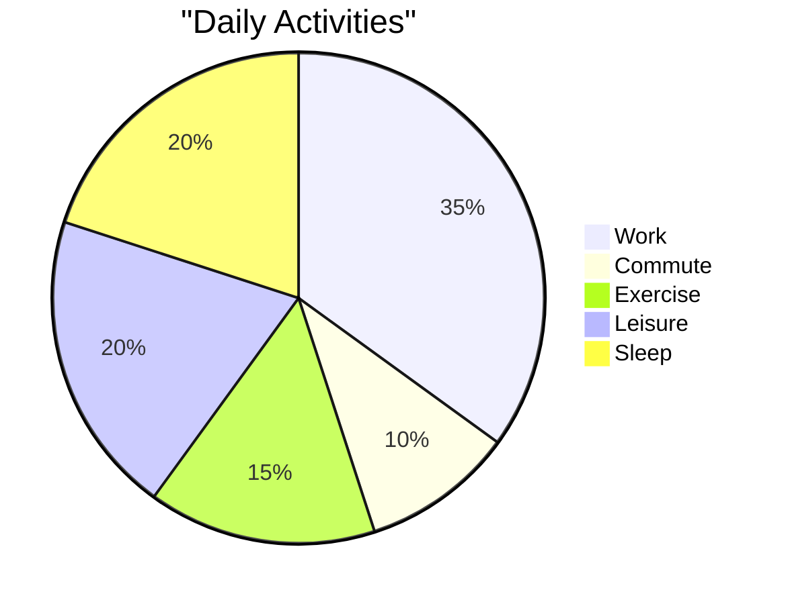
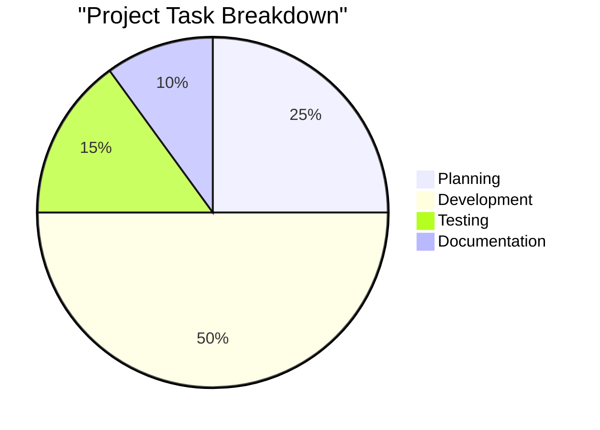
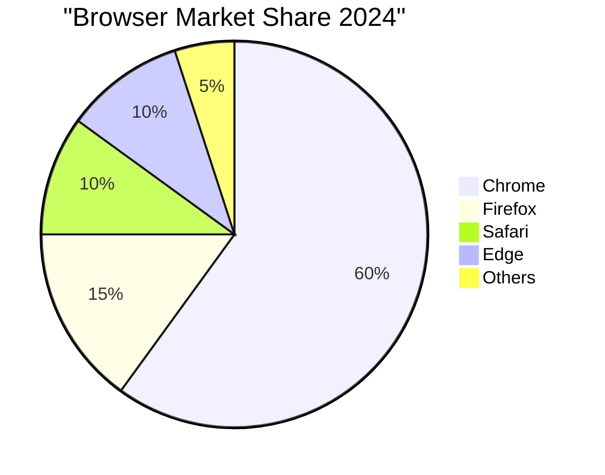
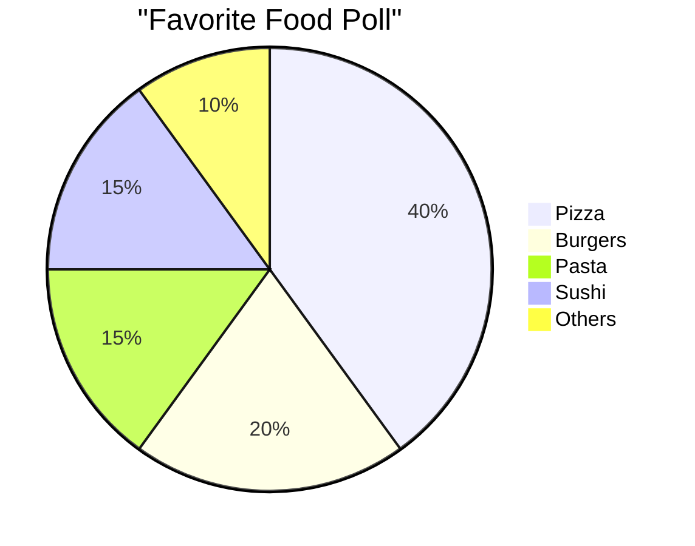

## Netflix Time Distribution

```mermaid
pie title NETFLIX
    "Time spent looking for movie!" : 90
    "Time spent watching it!" : 10
```

## Daily Activities

```mermaid
pie title "Daily Activities"
    "Work" : 35
    "Commute" : 10
    "Exercise" : 15
    "Leisure" : 20
    "Sleep" : 20
```

## Project Task Breakdown

```mermaid
pie title "Project Task Breakdown"
    "Planning" : 25
    "Development" : 50
    "Testing" : 15
    "Documentation" : 10
```

## Browser Market Share

```mermaid
pie title "Browser Market Share 2024"
    "Chrome" : 60
    "Firefox" : 15
    "Safari" : 10
    "Edge" : 10
    "Others" : 5
```

## Favorite Food

```mermaid
pie title "Favorite Food Poll"
    "Pizza" : 40
    "Burgers" : 20
    "Pasta" : 15
    "Sushi" : 15
    "Others" : 10
```
