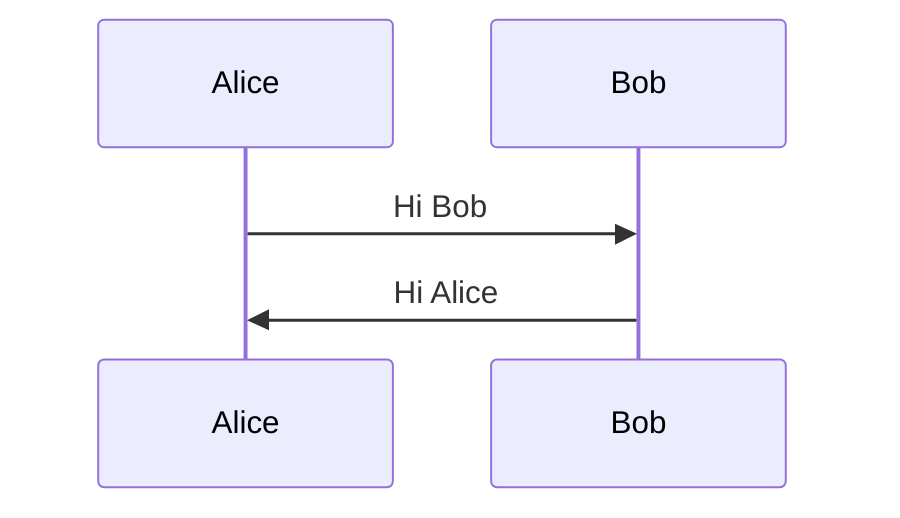
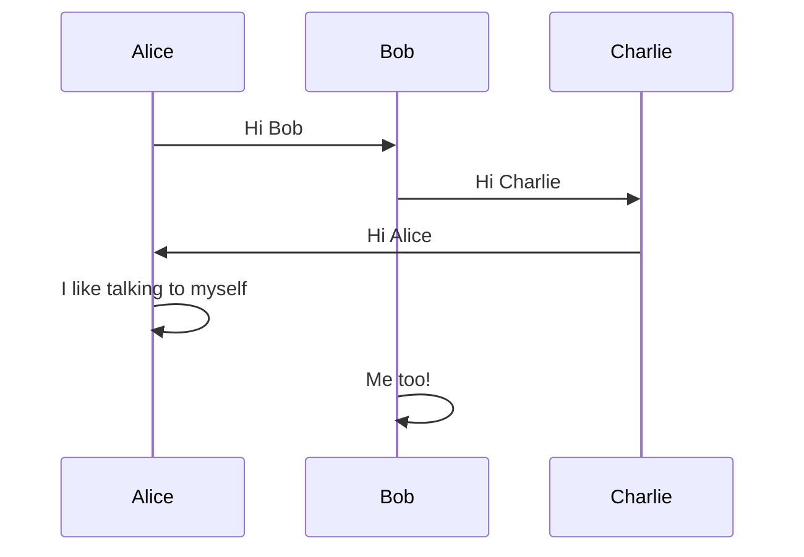
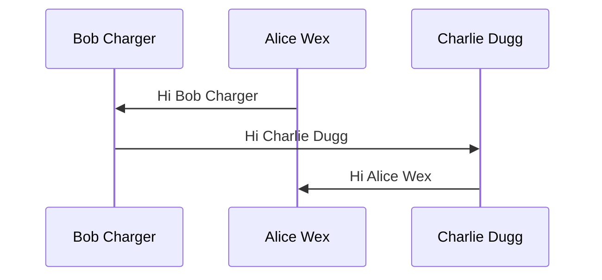
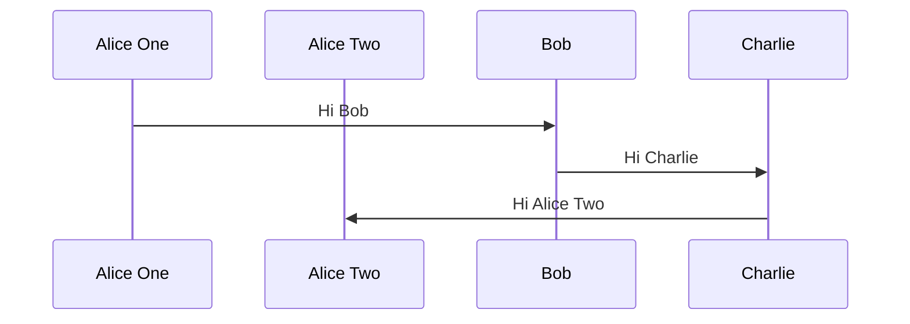

### Bello world

### Test Case 1: Simple Sequence Diagram


### Test Case 2: Sequence Diagram With More Participants


### Test Case 3: Sequence Diagram With Implicit Participant Declaration


### Test Case 4: Prev test but with random white spaces in mermaid


### Test Case 5: Empty sequenceDiagram
```mermaid
sequenceDiagram
```

### Test Case 6: Redeclare Participants
