# Heading

Lorem ipsum dolor sit amet, consectetur adipiscing elit. Fusce euismod nisl sit amet enim ornare commodo. Vivamus nec sodales nunc. Nulla in blandit magna, id vehicula orci. Proin gravida blandit nulla. Suspendisse in nulla lobortis erat efficitur interdum non vitae quam. Lorem ipsum dolor sit amet, consectetur adipiscing elit. Donec enim metus, fringilla sed porta eget, convallis quis felis. Curabitur eu consequat est. Proin facilisis quis purus sed elementum. Fusce rhoncus pellentesque mi id accumsan. Ut vitae diam eget mauris molestie vestibulum vitae sit amet ante. Cras suscipit ullamcorper consequat. Nulla erat magna, semper ac mi in, blandit imperdiet metus.

Vestibulum eget ex a odio convallis ullamcorper eget consequat odio. Sed auctor molestie efficitur. Integer ut magna eleifend, ultrices dolor ac, pulvinar lacus. Vestibulum id condimentum dolor, nec auctor tortor. Praesent consectetur lobortis arcu. Mauris vitae sapien eget ipsum volutpat scelerisque. Suspendisse ac diam lacus. Donec pharetra nisl non mattis tristique. Morbi elementum efficitur velit. Vestibulum ante ipsum primis in faucibus orci luctus et ultrices posuere cubilia curae; Suspendisse quis elit sit amet ex ullamcorper porta id ut ex. Praesent tincidunt volutpat lacus id condimentum. Curabitur eget dolor pellentesque, porttitor turpis quis, vehicula ligula. In lobortis lacus pellentesque ipsum maximus tempus vel id sem. Aliquam eros nisi, efficitur nec dolor nec, faucibus elementum quam.

Pellentesque habitant morbi tristique senectus et netus et malesuada fames ac turpis egestas. Fusce ipsum purus, pellentesque ut odio eget, semper sagittis nulla. Cras lacinia semper venenatis. Donec gravida eget lorem ac vestibulum. Integer eu facilisis arcu. Maecenas placerat risus sit amet sem facilisis, a eleifend metus pulvinar. Morbi id sagittis arcu. Etiam vel felis varius, egestas nisi ac, tincidunt tortor. Cras gravida nulla in nisl eleifend viverra. Aliquam at interdum urna. Nam sit amet turpis iaculis, vulputate magna id, luctus nibh. Praesent eleifend vestibulum rutrum.

Etiam scelerisque libero orci. Donec imperdiet nibh vitae ipsum sodales, ut placerat eros eleifend. Class aptent taciti sociosqu ad litora torquent per conubia nostra, per inceptos himenaeos. Maecenas suscipit luctus neque eu pellentesque. Nam sem metus, blandit non lacus sed, porttitor iaculis elit. Nullam varius egestas lacus, at pellentesque purus blandit vel. Pellentesque maximus pretium lacinia. Etiam posuere varius orci, et condimentum tortor tristique quis. Nulla facilisi. Pellentesque porta vulputate tellus quis dignissim. Fusce et lorem bibendum neque facilisis sollicitudin.

Aliquam erat volutpat. In finibus urna pellentesque risus dignissim, vitae blandit eros ornare. Donec consectetur hendrerit ex, eu tempus mauris convallis id. Donec vitae tortor fermentum, ornare tellus eu, placerat velit. Phasellus lectus lectus, posuere in ligula a, rhoncus imperdiet nulla. Donec non erat quis quam faucibus placerat in vel diam. Suspendisse accumsan ullamcorper pellentesque. Ut accumsan sodales orci et posuere. Integer est ante, faucibus in viverra vel, faucibus nec elit. Curabitur cursus urna quis tristique rutrum. Morbi laoreet odio a urna pulvinar fermentum. Donec turpis sapien, iaculis eu tincidunt quis, ultrices vel elit. Etiam hendrerit purus gravida libero finibus placerat. Lorem ipsum dolor sit amet, consectetur adipiscing elit. Mauris tempus magna vel ante pretium finibus.


### Test Case 1: Simple Linear Graph
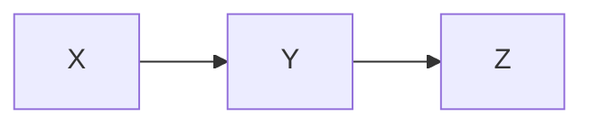

### Test Case 2: Branching Graph
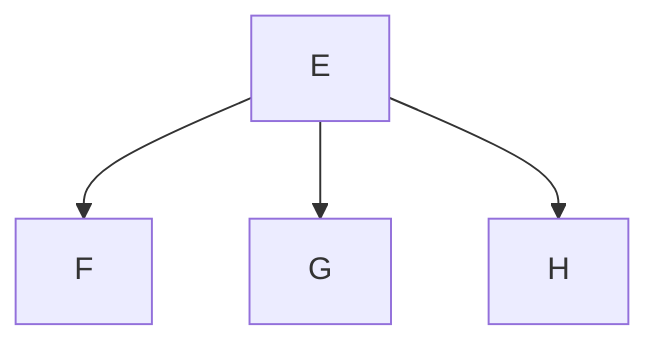

### Test Case 3: Complex Graph with Multiple Connections
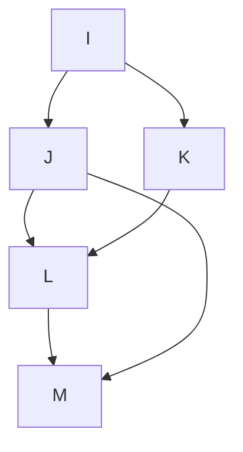

### Test Case 4: Cyclic Graph
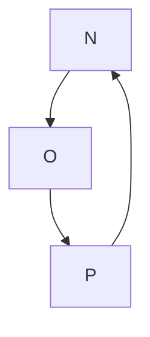

### Test Case 5: Larger Acyclic Graph
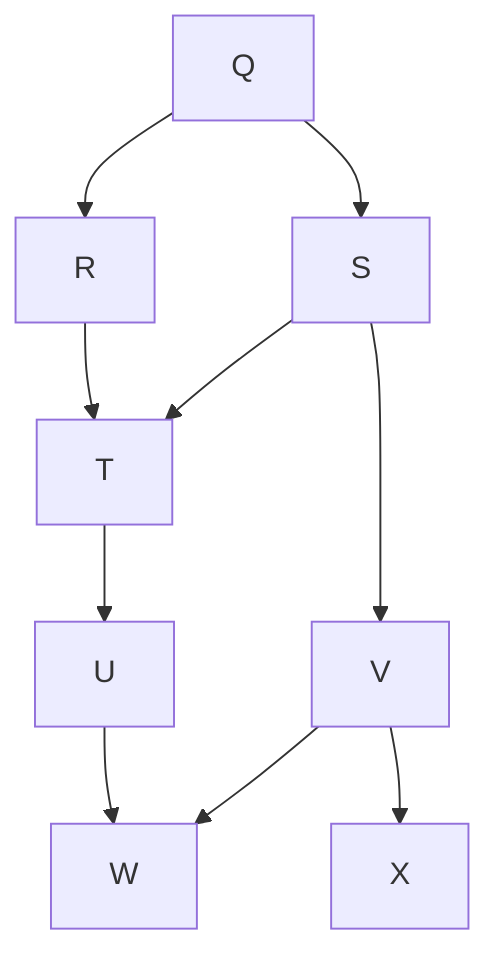

### Test Case 6: Deep Tree Structure
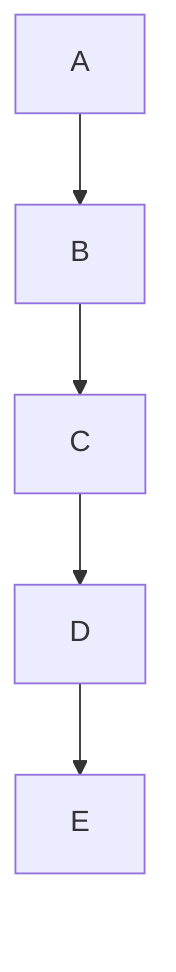

### Test Case 7: Wide Tree Structure
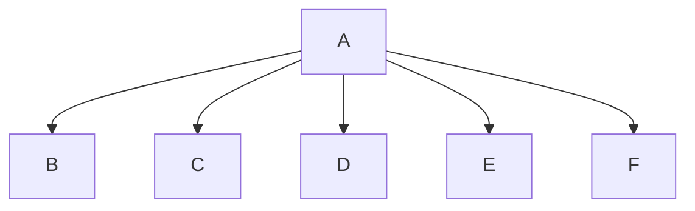

### Test Case 1: Simple Sequence Diagram
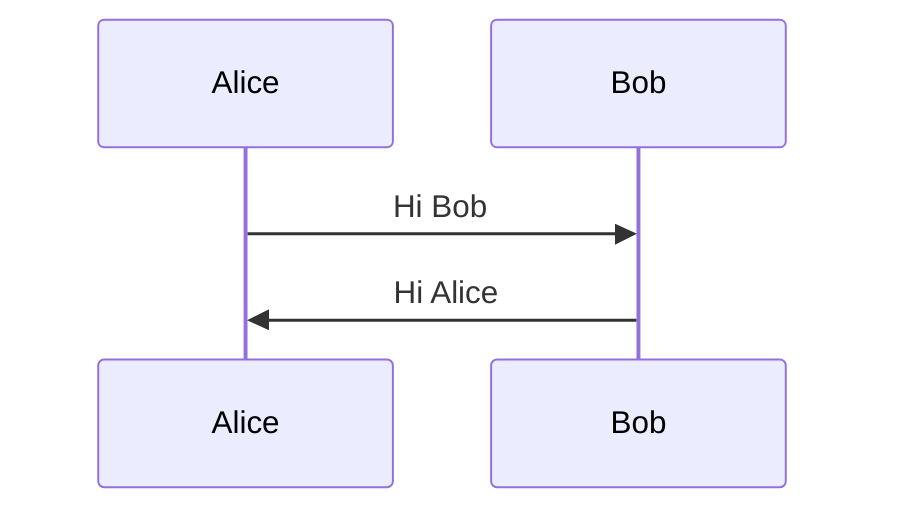

### Test Case 2: Sequence Diagram With More Participants
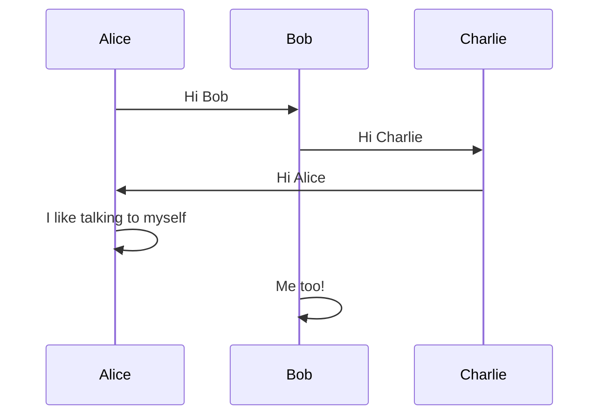

### Test Case 3: Sequence Diagram With Implicit Participant Declaration
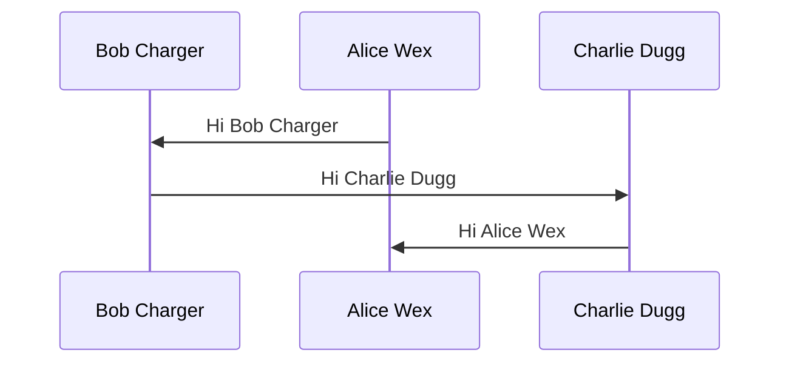

### Test Case 4: Prev test but with random white spaces in mermaid


### Test Case 5: Empty sequenceDiagram
```mermaid
sequenceDiagram
```

### Test Case 6: Redeclare Participants
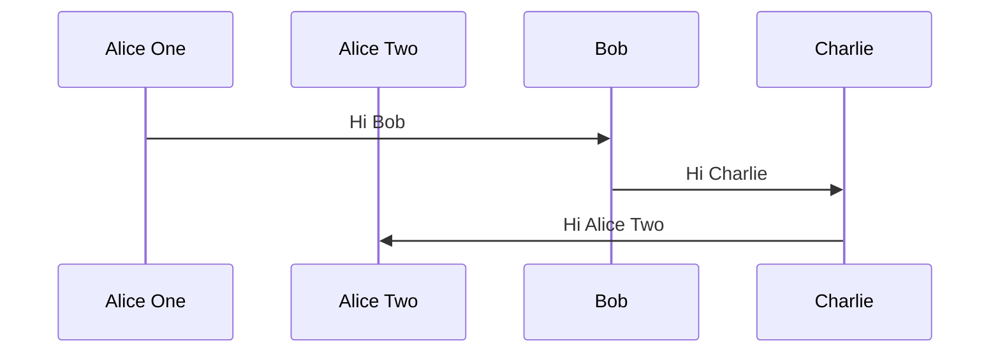

## Netflix Time Distribution

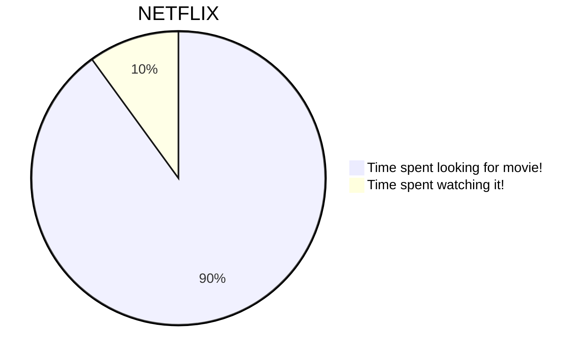

## Daily Activities

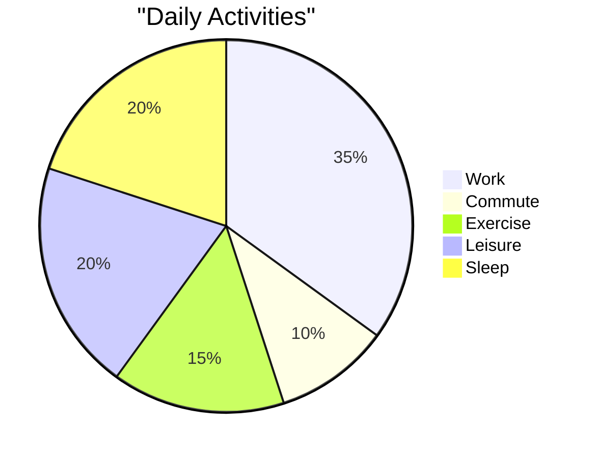

## Project Task Breakdown

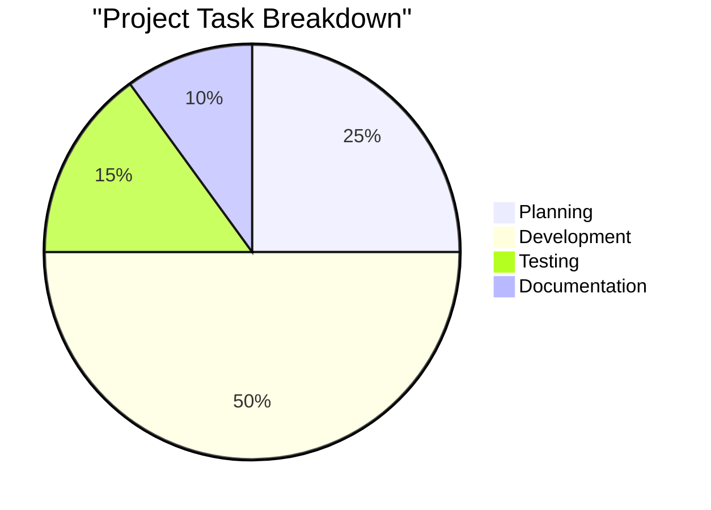

## Browser Market Share

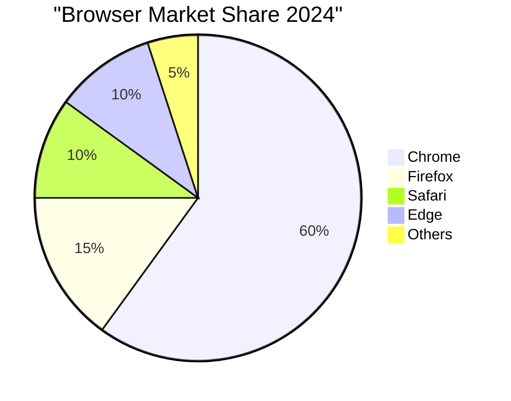

## Favorite Food

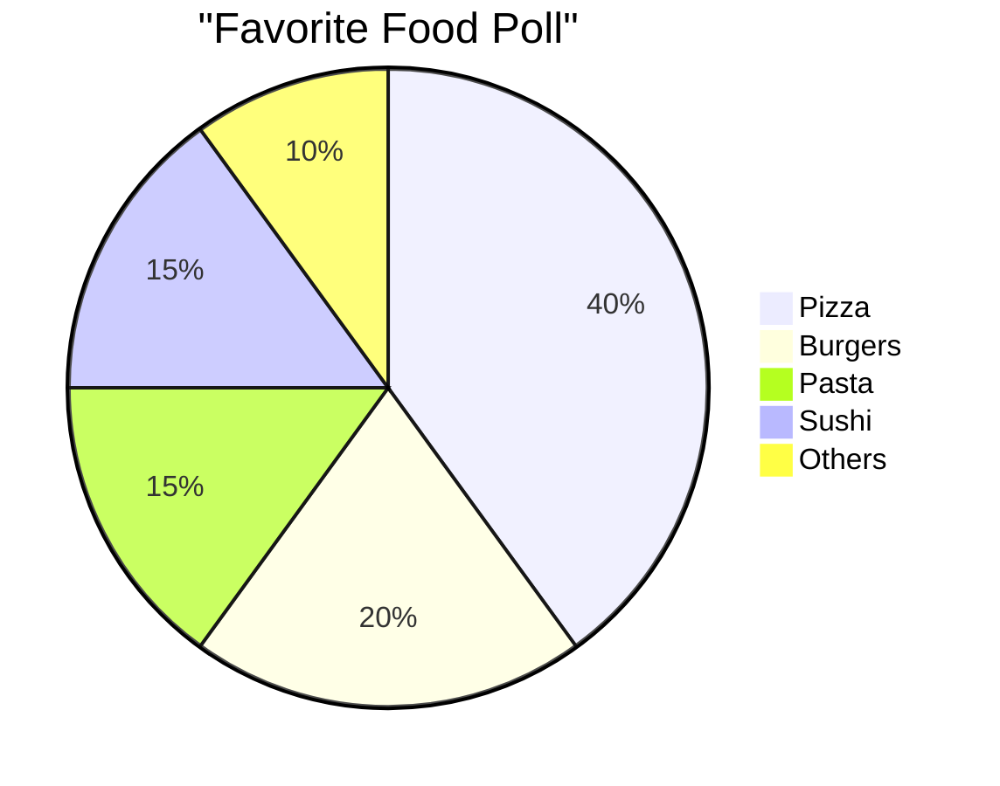

### Test Case 1: Basic Single Class with No Relationships
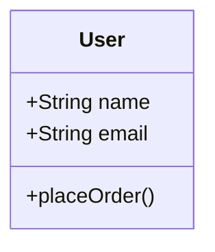


### Test Case 2: Association Relationship
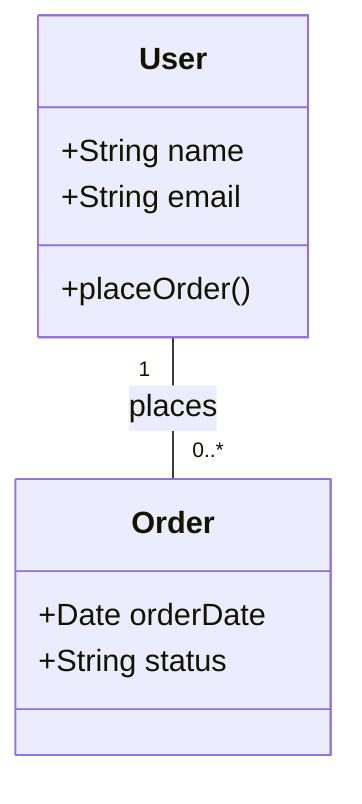

### Test Case 2: Aggregation Relationship
```mermaid
classDiagram
    User "1" -- "0..*" Order : has

    class User {
      +String name
      +String email
      +placeOrder()
    }
    class Order {
      +Date orderDate
      +String status
    }
```


### Test Case 3: Composition Relationship
```mermaid
classDiagram
    ShoppingCart "1" -- "0..*" Item : contains

    class ShoppingCart {
      +List<Item> items
    }
    class Item {
      +String name
      +float price
    }
```


### Test Case 4: Inheritance
```mermaid
classDiagram
    Employee "1" -- "0..*" Person : inherits

    class Person {
      +String name
      +Date birthDate
    }
    class Employee {
      +String department
    }
```


### Test Case 5: Complex Diagram with Multiple Relationships
```mermaid
classDiagram
    User "1" -- "0..*" Order : places
    Order "1" -- "1..*" Product : contains

    class User {
      +String name
      +String email
    }
    class Product {
      +String name
      +float price
    }
    class Order {
      +Date orderDate
    }
```


### Test Case 6: Complex Diagram with Multiple Relationships
```mermaid
classDiagram
    User "1" -- "0..*" Order : places
    Order "1" -- "1..*" Product : contains

    class User{
      +String name
      +String email
      +placeOrder()
    }
    class Order{
      +Date orderDate
      +String status
    }
    class Product{
      +String name
      +float price
    }
```
