# What are your career aspirations?

My career aspirations revolve around contributing to the field of operations research and urban transportation design through research. I am passionate about finding innovative solutions to complex problems within urban environments, particularly focusing on optimizing transportation systems. My interest in operations research lies in its powerful applications to decision-making processes and problem-solving methodologies. I envision myself engaging in research that addresses the challenges of urban mobility and transportation efficiency. Simultaneously, I aspire to share my knowledge and insights with the next generation of professionals through teaching. I aim to make a meaningful impact on the field and explore the fascinating application of operations research in urban transportation design.

# Share with us one skill, talent, or expertise you would like to develop and enhance if you have the available resources. \*

## Rewrite Attempt

Throughout my undergraduate study in the area of Operations Research, I find myself turning to my Computer Science peers for assistance. I frequently sought their insights to enhance my various programming projects, typically when I was programming my simulations. They often provided valuable recommendations on software architecture and code optimization, significantly improving my project outcomes. Through my simulation projects, I typically delve into some Computer Science subjects such as algorithms, high-performance computing and software design. But I think the topic that presently intrigues me the most is the field of programming language theory.

## Current One

It might seem like an easy choice, but I would still choose Computer Science as the expertise I aim to develop. Admittedly, Computer Science is a vast domain encompassing various subjects like compilers, data structures, algorithms, computer systems engineering, and machine learning, among others.

Throughout my undergraduate studies, particularly as I advanced in Operations Research, I increasingly found myself turning to my Computer Science peers for assistance. I frequently sought their insights to enhance my projects, such as simulations. They often provided valuable recommendations on software architecture and code optimization, significantly improving my project outcomes. One memorable instance was during my third year, when I concurrently undertook a module on high-performance computing and algorithms alongside working on my MRT simulation for a simulations course. This combination revealed the relevance of high-performance computing in simulation processes, enabling me to parallelize and expedite experiment runtimes. Additionally, while developing commuter agents for my simulation, I encountered the Floyd-Warshall Algorithm, which intrigued me and sparked my interest in furthering my proficiency in data structures and algorithms.

Beyond high-performance computing and algorithms, another area of Computer Science I'm keen to explore is functional programming. Introduced to me through a Computerphile video on YouTube, functional programming's concepts like Monads and Pure functions intrigued me. I envisioned creating safe, reliable programs with consistent, explainable results—a departure from the conventional imperative programming paradigm. The resemblance of Lambda Calculus to familiar mathematical concepts like Linear Algebra further piqued my interest, motivating me to delve deeper into the subject.

To deepen my understanding of Computer Science, I've undertaken various courses, such as Information Retrieval, which introduced me to BM-25—a statistical method with familiar overlaps in document matching. Presently, I'm enrolled in a Programming Language Concepts course, where I'm gaining insights into introductory C programming and exploring the world of Compilers. The functionality of programming languages and the intricacies of Compiler operations fascinate me.

In conclusion, as I progress in my undergraduate studies in Operations Research, I recognize Computer Science as a valuable complementary skill. It enhances my ability to develop simulations and optimization programs effectively. The intertwined nature of these fields underscores the importance of acquiring expertise in both areas to advance my work further.

# Briefly describe how your participation in past research/intellectual activities demonstrates your passion for science and R&D. \*

Throughout my undergraduate studies, my mantra has been, "I like the math." Undoubtedly, my passion lies in delving into the intricacies of mathematics rather than pursuing the conventional paths associated with my major, which often lead to careers in product management or supply chain analysis. Instead, I find myself engrossed in clarifying complex mathematical concepts long after classes have ended.

My fervor for science and research is most vividly expressed through the projects I undertake. I am driven to push the boundaries of my knowledge and apply it creatively. For instance, during my optimization module, I seized the opportunity to tackle a challenging problem faced by the e-commerce company where I was interning. Tasked with determining the optimal stocking levels for various items considering configurable shelves, I immersed myself in formulating a solution. Despite the absence of clear guidance in academic literature, I persisted, ultimately developing a complex yet rewarding solution.

Similarly, in my Simulations Course, when suggested to start with a smaller-scale project, I opted to simulate the entire Singapore MRT system. Even when advised otherwise, I embraced the challenge, expanding the scope of my simulation to include the creation of new MRT lines. This project remains one of my proudest achievements, showcasing my ability to push the limits of simulation capabilities.

My professors have consistently recognized my abilities throughout my coursework. I even sought out opportunities to expand my knowledge, such as sitting in on graduate-level optimization classes, which proved to be profoundly stimulating and provided deeper insights into foundational concepts.

In my pursuit of excellence, I often draw inspiration from existing scholarly works. While constructing my optimization model, I researched existing literature on bin packing and stock optimization. However, I also encountered instances, such as the consideration of configurable shelf structures, where the literature fell short, prompting me to explore innovative solutions.

My thirst for knowledge extends beyond the classroom, as evidenced by my participation in undergraduate research opportunities. In December 2022, I eagerly seized the chance to intern at the Tokyo Institute of Technology in Japan, immersing myself in research papers on topics ranging from Graph Neural Networks to Financial Sentiment Analysis. This experience underscored the gaps in current research and fueled my aspiration to contribute to the development of more robust causal models for AI.

In conclusion, my coursework projects and research experiences demonstrate my unwavering passion for science and research. Given the opportunity, I am eager to further expand my capabilities through continued exploration and involvement in research and development endeavors.

### Test Case 1: Simple Linear Graph
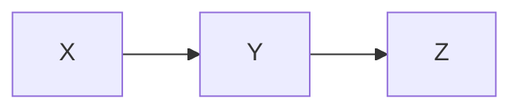

### Test Case 2: Branching Graph
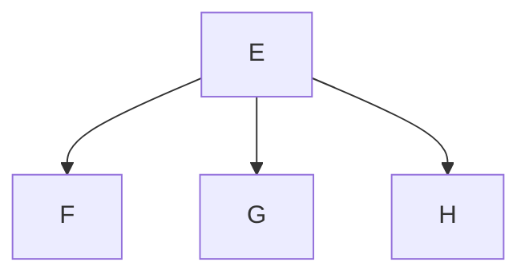

### Test Case 3: Complex Graph with Multiple Connections
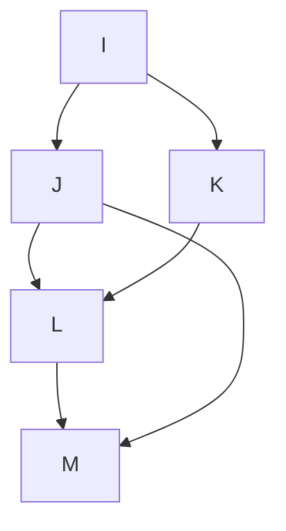

### Test Case 4: Cyclic Graph
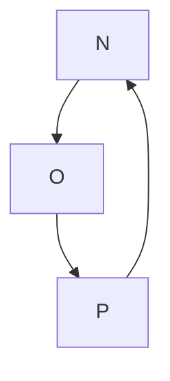

### Test Case 5: Larger Acyclic Graph
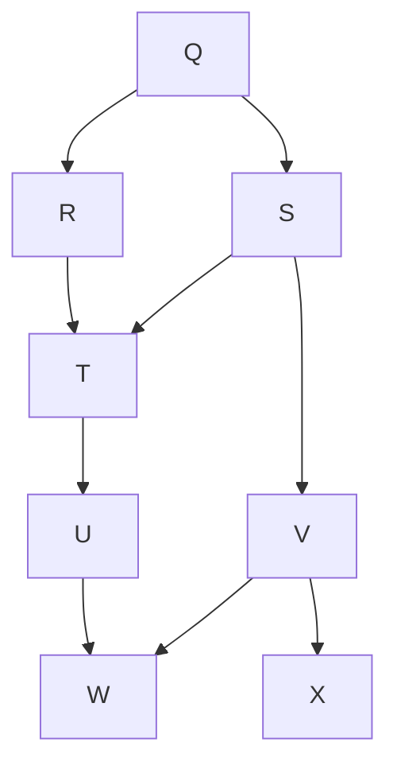

### Test Case 6: Deep Tree Structure
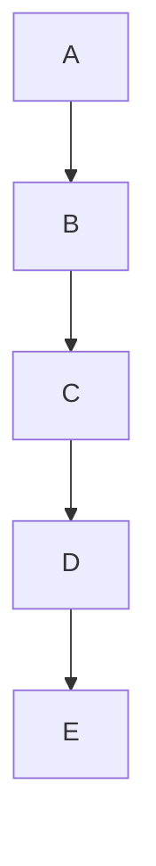

### Test Case 7: Wide Tree Structure
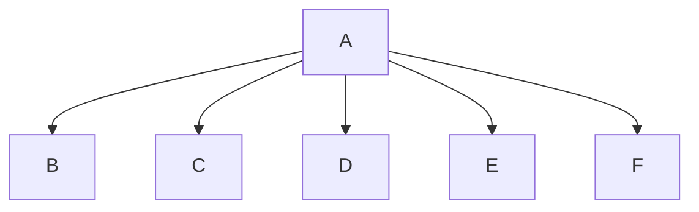

### Test Case 1: Simple Sequence Diagram
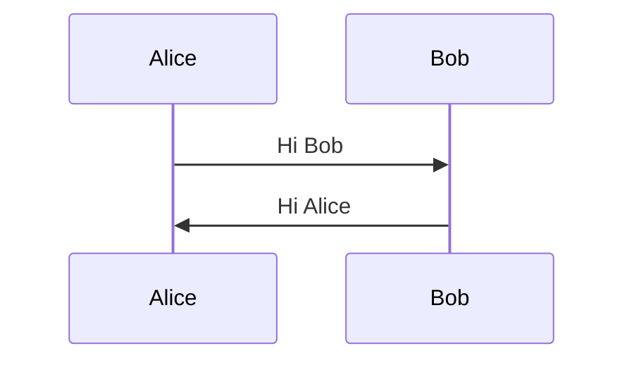

### Test Case 2: Sequence Diagram With More Participants
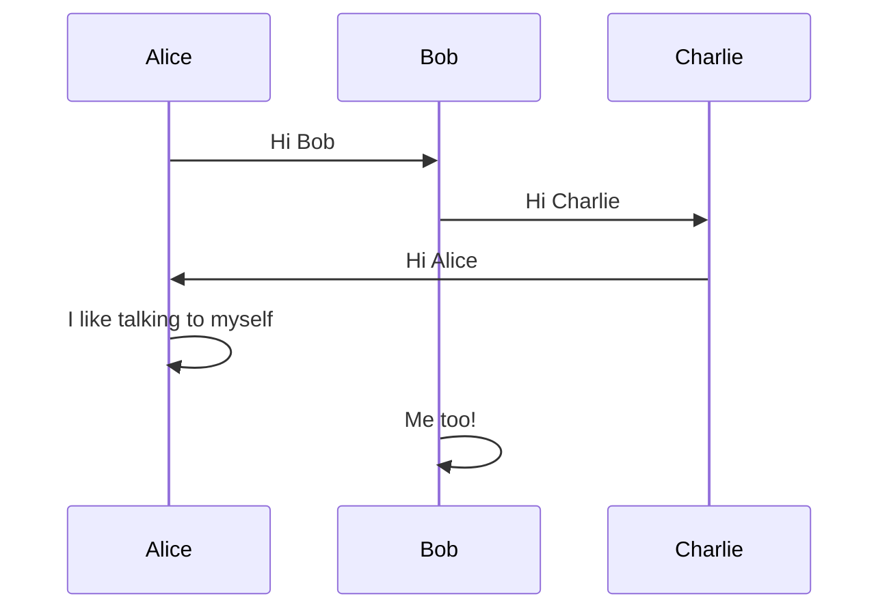

### Test Case 3: Sequence Diagram With Implicit Participant Declaration
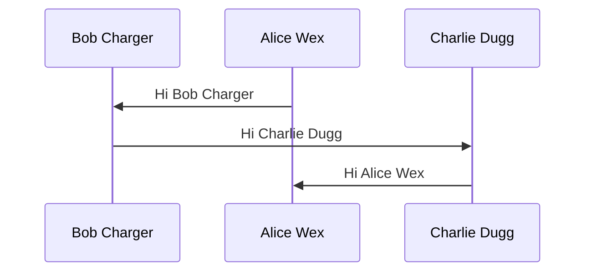

### Test Case 4: Prev test but with random white spaces in mermaid


### Test Case 5: Empty sequenceDiagram
```mermaid
sequenceDiagram
```

### Test Case 6: Redeclare Participants
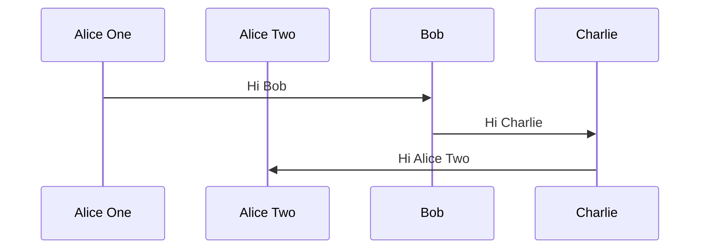

## Netflix Time Distribution

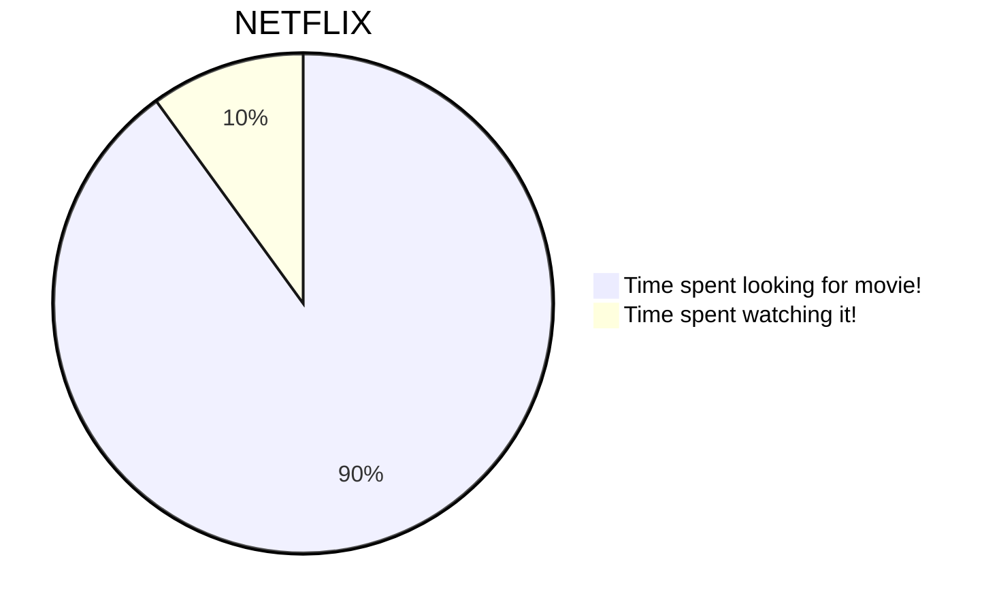

## Daily Activities

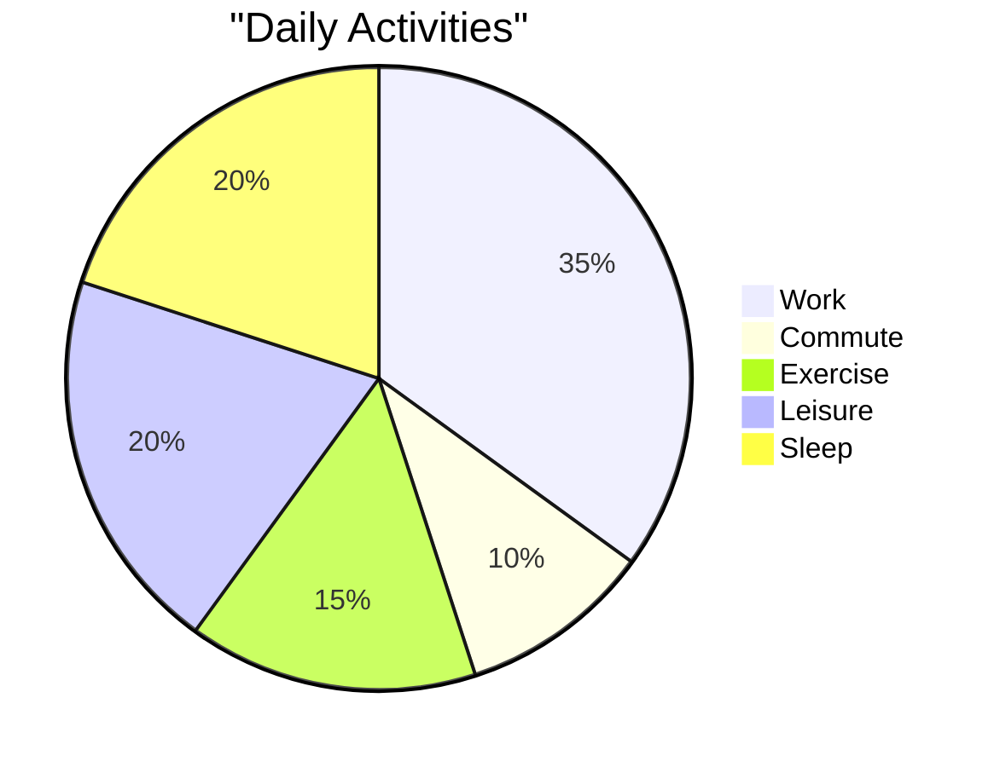

## Project Task Breakdown

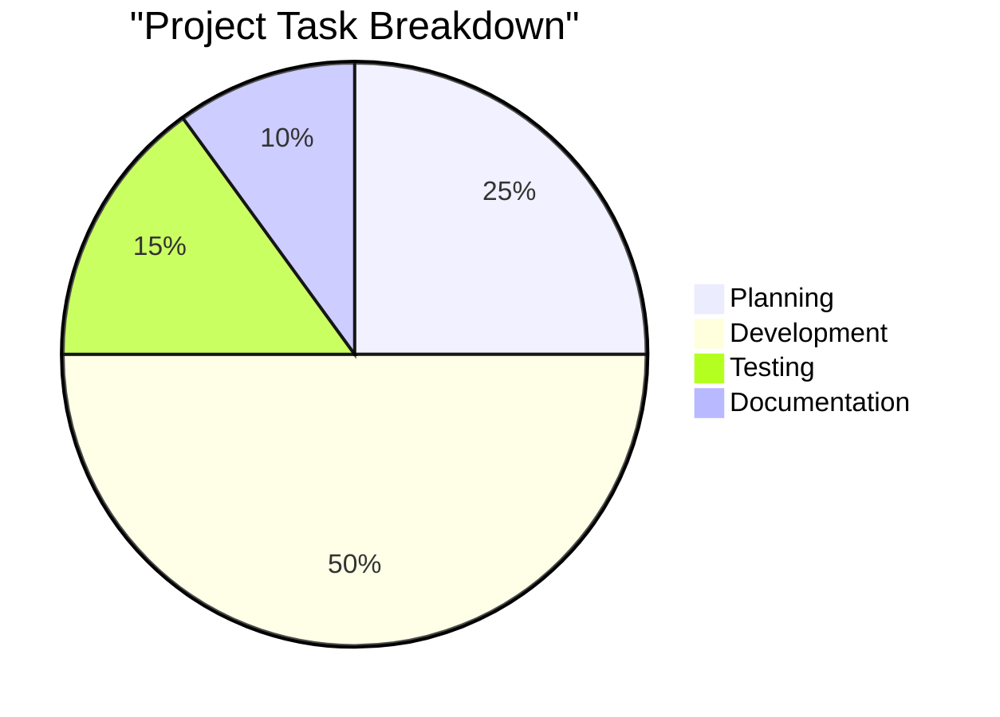

## Browser Market Share

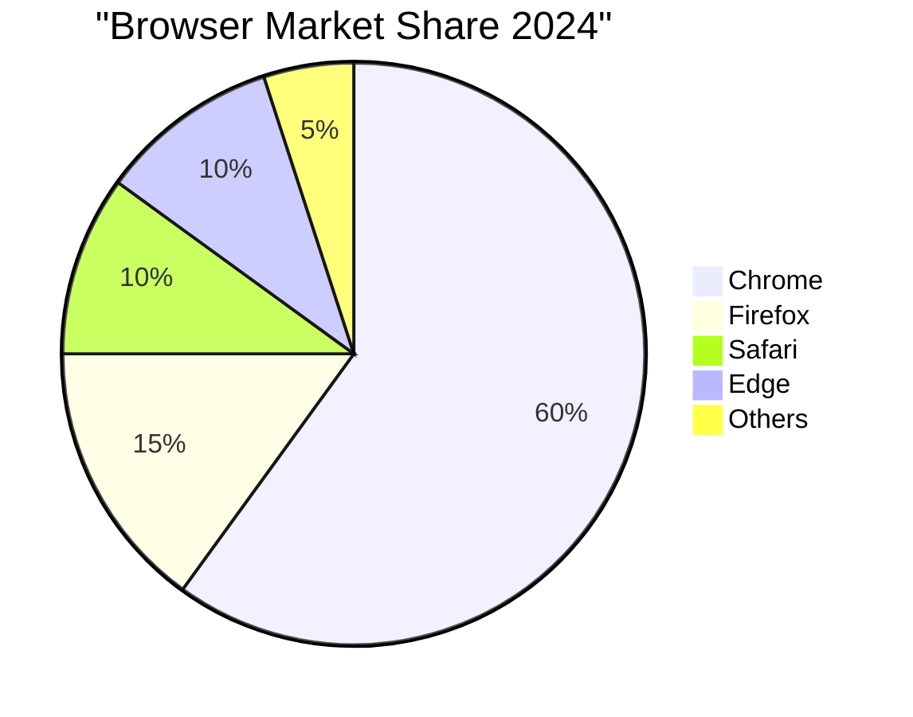

## Favorite Food

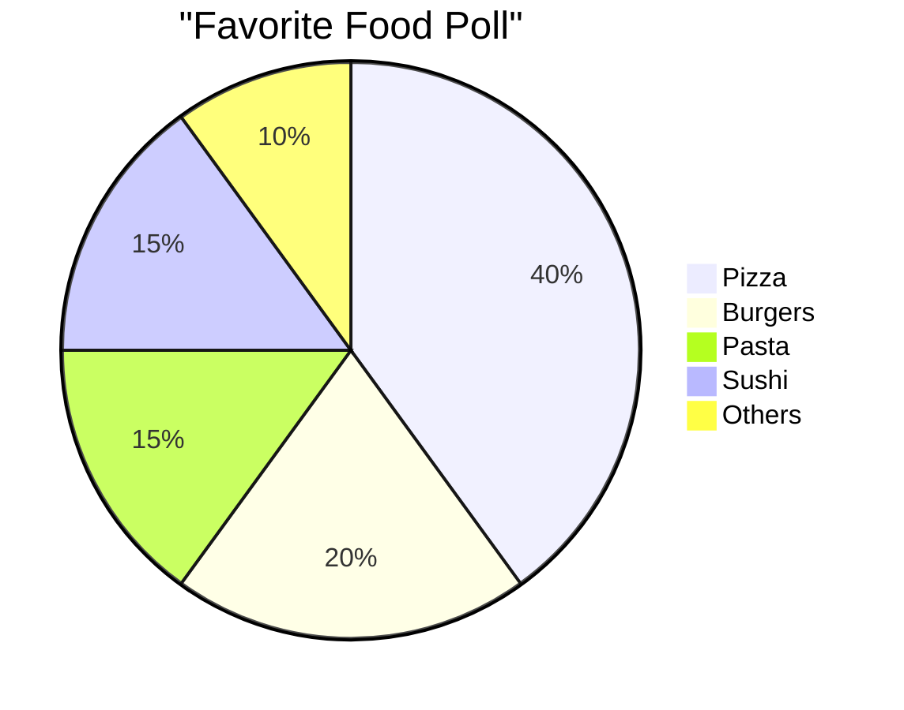

### Test Case 1: Basic Single Class with No Relationships
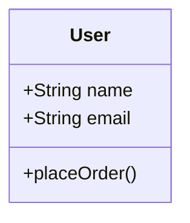


### Test Case 2: Association Relationship
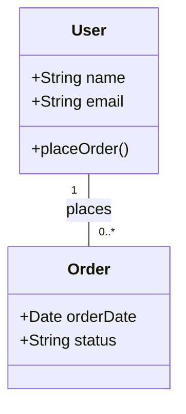

### Test Case 2: Aggregation Relationship
```mermaid
classDiagram
    User "1" -- "0..*" Order : has

    class User {
      +String name
      +String email
      +placeOrder()
    }
    class Order {
      +Date orderDate
      +String status
    }
```


### Test Case 3: Composition Relationship
```mermaid
classDiagram
    ShoppingCart "1" -- "0..*" Item : contains

    class ShoppingCart {
      +List<Item> items
    }
    class Item {
      +String name
      +float price
    }
```


### Test Case 4: Inheritance
```mermaid
classDiagram
    Employee "1" -- "0..*" Person : inherits

    class Person {
      +String name
      +Date birthDate
    }
    class Employee {
      +String department
    }
```


### Test Case 5: Complex Diagram with Multiple Relationships
```mermaid
classDiagram
    User "1" -- "0..*" Order : places
    Order "1" -- "1..*" Product : contains

    class User {
      +String name
      +String email
    }
    class Product {
      +String name
      +float price
    }
    class Order {
      +Date orderDate
    }
```


### Test Case 6: Complex Diagram with Multiple Relationships
```mermaid
classDiagram
    User "1" -- "0..*" Order : places
    Order "1" -- "1..*" Product : contains

    class User{
      +String name
      +String email
      +placeOrder()
    }
    class Order{
      +Date orderDate
      +String status
    }
    class Product{
      +String name
      +float price
    }
```
